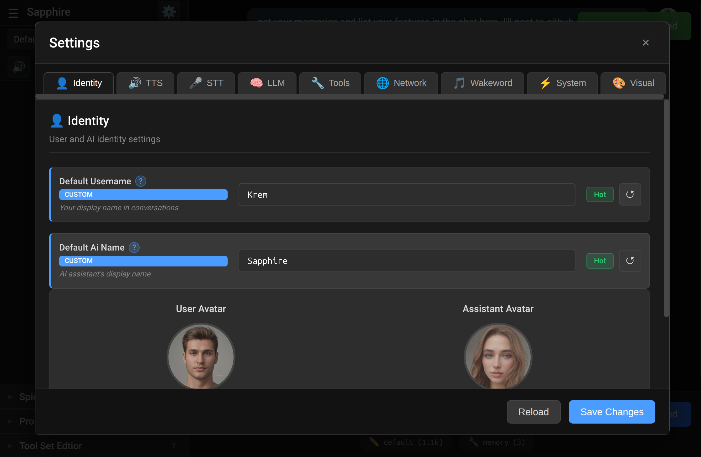
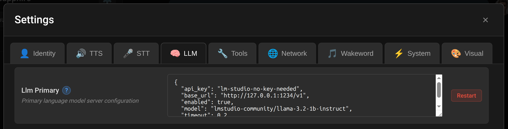
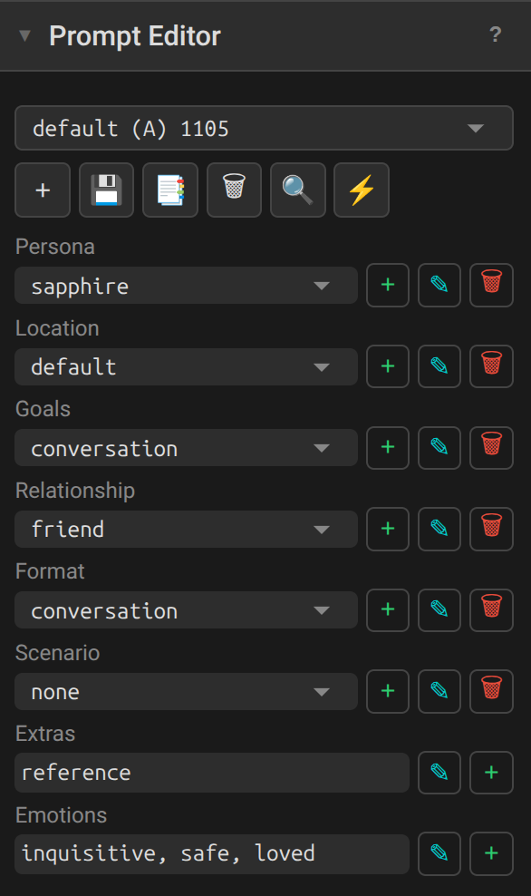
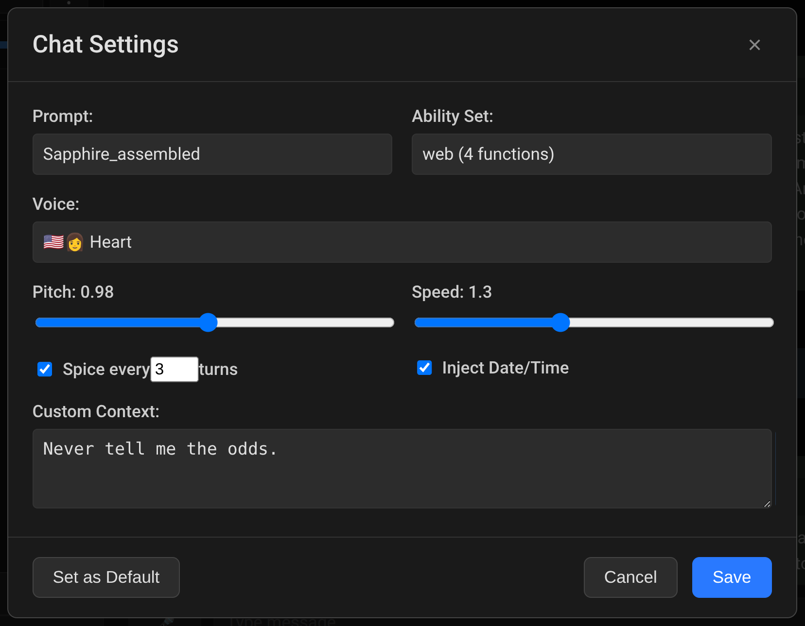
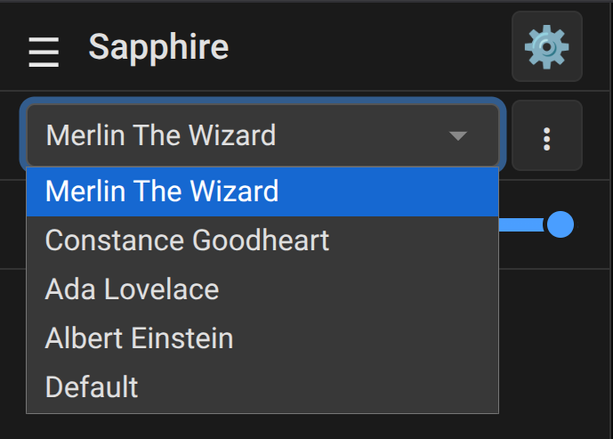

# Configuration

## Quickstart

**Most configuration happens in the web UI.** Click the gear icon to access settings.



To run Sapphire for the first time:
```bash
python main.py
```
Visit `https://localhost:8073`, set your password, and you're in.

**You need an LLM server running.** LM Studio or llama.cpp with the API enabled and a model loaded. The model you choose determines a lot about personality and capability. Qwen3 8B is a simple test to confirm things work. The defaults include LM Studio locally, so just open LM Studio, enable the API, and this default address already reaches out to it.



**Things you might want to change before your first real conversation:**

| Setting | Where | What |
|---------|-------|------|
| LLM endpoint | Settings → LLM | Point to your local LM Studio by default, reconfigure to match llama.cpp or any OpenAI endpoint |
| Names | Settings → Identity | Your name and AI name |
| STT recording cutoff | Settings → Wakeword | Raise "Recorder Background Percentile" to 40-ish on a webcam mic or STT wont cut off |

Everything else has sensible defaults. Explore the Settings UI - each option has help text explaining what it does.

---

## Now make your own persona

Each chat can have completely different personas, voices, and capabilities. Switch between them instantly.

<table>
<tr>
<td width="33%">

[](screenshots/settings-manager.png)

</td>
<td>

### Make the Settings Yours
- Gear icon → App Settings 
- Change names and avatars
- Enable TTS, STT, and Wakeword if desired
- Pick your wake word and adjust background noise sensitivity

</td>
</tr>
<tr>
<td width="33%">

[](screenshots/prompt-editor-assembled.png)

</td>
<td>

### Make the Prompt Yours
- Open the Prompt editor in the sidebar, click **+**
- Choose **Assembled** (more customizable) and name it
- Click **+** next to sections to add:
  - **Persona** - Who the AI is. (You are William)
  - **Relationship** - Who you are to the AI (I am Jackie)
  - **Location** - Optional - where is the chat taking place
  - **Goals** - Optional - what are the AI's goals
  - **Format** - Optional - tell it how to hold conversation or length of story
  - **Scenario** - Optional - What is happening in the story world
  - **Extras** - Optional - Misc prompt pieces you want to swap in and out
  - **Emotions** - Optional - happy, loved, confident, etc
- Save with the disk icon

Note: Write prompt from first person. You should refer to yourself as "I" in prompts, refer to your AI as "You".

</td>
</tr>
<tr>
<td width="33%">

[](screenshots/per-chat-settings.png)

</td>
<td>

### Set up your default chat settings 
- Open the default chat (upper left), click **... → Chat Settings**
- Select your preferred prompt
- Choose which tools the AI can use
- Set TTS voice, pitch, speed
- **SPICE** adds randomness to replies
- **Inject Date** lets the AI know the current date
- **Custom text** is always included in addition to system prompt
- Click **Set as Default** then **Save**

Note: Set as Default is for all future chats. Save is for this chat only. Each chat has its own settings.

</td>
</tr>
<tr>
<td width="33%">

[](screenshots/chat-personality-switcher.png)

</td>
<td>

### Make Multiple Personas
- Click **...** next to any chat name → **New chat**
- Configure that chat differently via **... → Chat Settings**
- Each chat maintains its own prompt, voice, and tool configuration
- So change the voice, toolset, prompt etc and save it

</td>
</tr>
</table>

---

## Advanced personalization

### Your own plugins 
You can do a lot with this system. Plugins and Tools are expansions you can add. You just feed the whole plugins.md file into an AI and it can spit out your own personalized plugins, generally on the first try. Just drop them in your user/plugins dir. Plugins are called by the user via keywords, or they can run services in the background. [See more](PLUGINS.md)

### Your tools
Tools are used by the AI directly when it wants. Simpler than plugins, these are one file in user/functions/. Make your own tools to turn off your computers, type via your voice, check if your website is online, or simulate email capability to see what they AI emails out. [See more](TOOLS.md)

### Different wakeword
Sapphire loads open wake word ONNX models from user/wakeword/models/ if you want to drop some ONNX in our wakeword dir. 

[More wakewords](https://github.com/fwartner/home-assistant-wakewords-collection)

## Technical Reference

For developers and those who want to understand the internals.

### Configuration Layers

```
core/settings_defaults.json    ← System defaults (don't edit)
        ↓ merged with
user/settings.json             ← Your overrides
        ↓ equals
Runtime config
```

On first run, `user/settings.example.json` is created as a template. Copy to `user/settings.json` and add only settings you want to override.

Settings can be changed via:
- **UI** - Gear icon (recommended)
- **File** - Edit `user/settings.json` (auto-detected within ~2 seconds)
- **API** - `PUT /api/settings/<key>`

### Reload Tiers

| Tier | When | Examples |
|------|------|----------|
| Hot | Immediate | Names, TTS voice/speed/pitch, generation params |
| Component | Restart needed | TTS/STT enabled, server URLs, module toggles |
| Restart | Restart needed | Ports, paths, model configs |

The UI indicates the tier for each setting.

### Key File Locations

| File | Purpose |
|------|---------|
| `core/settings_defaults.json` | System defaults (read-only) |
| `core/settings_help.json` | Help text for UI |
| `user/settings.json` | Your overrides |
| `user/settings/chat_defaults.json` | Defaults for new chats |
| `~/.config/sapphire/secret_key` | Password hash |

### Authentication

The bcrypt hash serves as password, API key, and session secret. Delete to reset (triggers setup wizard).

- **Linux/Mac:** `~/.config/sapphire/secret_key`
- **Windows:** `%APPDATA%\sapphire\secret_key`

### Default Ports

These are the original defaults (adjustable in Settings):

- Internal API: `127.0.0.1:8071`
- Web UI: `0.0.0.0:8073` (HTTPS)
- TTS Server: `5012`
- STT Server: `5050`

### SOCKS Proxy Authentication

Two options for proxy credentials:

**Option 1 - Config file** (recommended): Create `user/.socks_config` with username on line 1, password on line 2.

**Option 2 - Environment variables:**
- `SAPPHIRE_SOCKS_USERNAME`
- `SAPPHIRE_SOCKS_PASSWORD`

### Troubleshooting

**Settings not working?** Restart Sapphire, verify JSON syntax, check logs.

**Reset to defaults?** Delete `user/settings.json` or the whole user/ dir if you want.

**Can't log in?** Delete `~/.config/sapphire/secret_key` and restart.