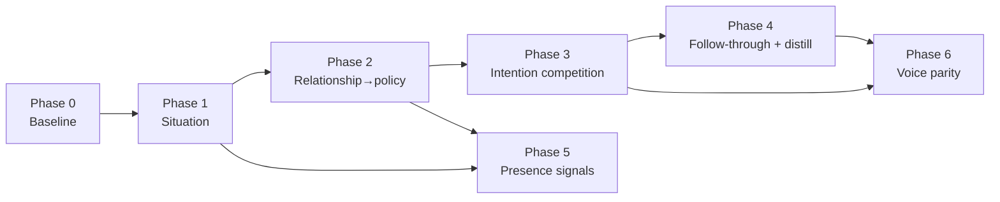

# Discord plugin — human world-model roadmap

Future rollout plan to make the Discord agent feel as human as possible **through the world-model loop** (observation → world state → intention → policy → execute), not by bolting on unrelated behaviors.

Related reading: [pluginflow.md](pluginflow.md), [settings reference](settings/README.md).

---

## Guiding principles

1. **Every human behavior answers three questions:** what changed in the world model, what intention did that create, and what policy allowed it?
2. **Plugin-local memory stays plugin-local.** People-memory, lore, and distill remain in Discord SQLite — not Sapphire core Mind — unless we deliberately design a bridge later.
3. **Prefer judgment over timers.** Cooldowns and % chances stay as safety rails; social timing should increasingly come from situation + relationship state.
4. **Ship in thin vertical slices.** Each phase should be usable and testable alone (settings + traces + pytest), then compose.

---

## Where we are (baseline)

| Layer | Status |
|-------|--------|
| Observations → world model (guilds, channels, users, messages, tasks) | In place |
| Reply / proactive intentions + policy gates | In place |
| Plugin people-memory (facts, milestones, interests, lore, ambient distill) | In place (distill opt-in) |
| Proactive rhythms (greeting, outreach, sleep, birthdays) | In place |
| Affect / activation schema | Tables exist; **not** steering policy |
| Channel “situation” model | Missing as a first-class object |
| Multi-intention competition | Mostly single-path gates |

---

## Rollout overview

| Phase | Theme | Goal | Rough effort |
|-------|--------|------|----------------|
| **0** | Baseline polish | Lock current memory/distill/docs; operator trust | Small |
| **1** | Channel situation model | She knows “what’s going on here” | Medium |
| **2** | Relationship → policy | Familiarity/fondness change *whether* and *how* she engages | Medium |
| **3** | Intention competition | Speak / react / wait / follow-up as scored choices | Medium–large |
| **4** | Follow-through & distill hygiene | Continuity and clean durable memory | Medium |
| **5** | Presence as social signal | Status/activity reflect world state | Small–medium |
| **6** | Voice social parity | Voice uses the same situation + relationship gates | Later |

Phases 1–2 are the highest leverage for “she’s actually here with us.” Phase 6 stays last on purpose: text social timing buys more humanity first.

---

## Phase 0 — Baseline polish (now → next patch)

**Goal:** Make the current stack trustworthy before adding judgment layers.

### Work
- Operator docs already started (`settings/`, `pluginflow.md`); keep them synced when settings change.
- Ambient distill: clear traces for buffer → distill → facts added; Memory test pathways covered.
- Soft-forget / pin / lore dropdowns: treat as the review surface for any auto-learned facts.
- Optional: distill merge/dedupe pass so `ambient_distill` doesn’t spam near-duplicates.

### Done when
- [x] Distill runs (cron + test button) leave readable traces.
- [x] Settings docs match WebUI tabs.
- [x] No critical gaps between README claims and live routes/schedules.

### Depends on
Nothing — can ship anytime.

---

## Phase 1 — Channel situation model

**Goal:** Each channel has a living snapshot the prompt and gates can read: who’s active, recent topics, vibe, thread heat, whether a joke just landed, whether she’s mid-conversation.

### Work
- Define a `ChannelSituation` (or equivalent) built from world-model messages + interest topics + optional lightweight heuristics (question density, mention density, silence age).
- Persist or cache short-lived situation (in-memory + optional SQLite snapshot is fine).
- Inject a compact situation block into `PromptContextService` / reply hints (data fence, not instructions).
- Start using situation in **organic reply** and **quiet outreach** eligibility (e.g. don’t outreach into a heated argument; do chime when the room went quiet after a shared topic).

### Settings (suggested)
- `cognitive.situation_enabled` (default on once stable)
- Optional verbosity for prompt injection

### Tests / operator
- Unit tests: situation from synthetic message windows
- Debug/traces: `situation_built`, fields used in gate decisions
- Memory/Debug preview of last situation per channel (optional)

### Done when
- [x] Every reply path can see a situation summary.
- [x] At least one gate (organic chance or outreach) uses situation, not only timers.
- [x] Traces show why a situation-based skip/allow happened.

### Depends on
Phase 0 recommended; world-model message history already required.

---

## Phase 2 — Relationship and affect → policy

**Goal:** Fondness, familiarity, interest (and later patience/trust) modulate engagement the way a person would — warmer to known people, quieter with strangers, less outreach when “tired.”

### Work
- Map existing profile scores into **policy multipliers**: organic reply chance, reaction chance, outreach willingness, forced-wake irritability.
- Optionally start writing light updates to unused columns (`interest` from interest graph, `patience` decay during spam).
- Keep hard safety caps (rate limits, bot debate safety) above soft social modulation.
- Prompt hint: relationship tone one-liner (“known regular” vs “new”) without dumping raw scores unless useful.

### Settings (suggested)
- `profile.relationship_policy_enabled` (default off → on)
- Optional strength slider or presets: subtle / normal / bold

### Tests / operator
- Pytest: same message, high vs low familiarity → different allow probabilities or thresholds
- Traces: `affect_modulated` / `relationship_gate` with before/after chance
- UI: show relationship scores in Memory Browse (already partially there via message counts; extend)

### Done when
- [x] Organic reply and at least one of {reaction, outreach, sleep wake} are relationship-sensitive.
- [x] Behavior change is observable in diagnostics without reading code.
- [x] Defaults remain conservative (no clingy stranger behavior).

### Depends on
Phase 1 helpful (situation × relationship is stronger together) but Phase 2 can start in parallel on reply/outreach only.

---

## Phase 3 — Intention competition

**Goal:** Replace “single gate → reply or drop” with a small scored set of intentions: reply, react-only, stay silent, schedule follow-up, proactive check-in.

### Work
- Introduce an intention scorer over world state + situation + relationship + sleep/energy.
- Policy ranks or samples one winner; losers may become deferred tasks (world-model `tasks`).
- Preserve existing intention types; add `stay_silent` / `react_only` as first-class outcomes (not just missing reply).
- Ensure cron proactive and reactive chat share the same scoring vocabulary where possible.

### Settings (suggested)
- `cognitive.intention_competition_enabled`
- Weights or preset profiles later (not required for v1)

### Tests / operator
- Fixtures: crowded channel + low familiarity → prefer silent/react
- Mention + high familiarity → prefer reply
- Trace payload lists candidate intentions and winner reason

### Done when
- [x] Non-reply outcomes are explicit intentions with traces.
- [x] At least one deferred follow-up path creates a world-model task.
- [x] No regression on mention/DM always-reply expectations (unless settings say otherwise).

### Depends on
Phases 1–2 (situation + relationship features to score on).

---

## Phase 4 — Follow-through and distill hygiene

**Goal:** Continuity — she remembers promises and keeps durable facts clean.

### Work
**Follow-through**
- Harden commitment/reminder detection and delivery copy so follow-ups feel natural (“you mentioned Thursday…”).
- Tie follow-ups to situation (don’t barge into a crisis channel; wait for a quiet beat).
- Surface pending commitments in prompt context sparingly.

**Distill hygiene**
- Merge near-duplicate facts; confidence decay on unused facts; optional soft-forget suggestions in Memory UI.
- Cap facts per user more intelligently (pinned survive).
- Review queue: list recent `ambient_distill` facts for operator approve/soft-forget (optional).

### Done when
- [x] Commitment follow-ups land with channel-aware timing.
- [x] Distill rarely creates duplicate or junk facts in normal chat.
- [x] Operators can clean auto-facts without wiping the user.

### Depends on
Phase 3 optional for “wait then follow up”; distill hygiene can proceed anytime after Phase 0.

---

## Phase 5 — Presence as social signal

**Goal:** Online status and activity line reflect world state, not only preset rotation.

### Work
- Map situations → presence hints: quiet night, active debate, post-goodnight asleep, focused in voice, etc.
- Keep cycling presets as a pool; situation can bias or temporarily override.
- Respect Safety quiet hours and sleep schedule as hard overrides.

### Done when
- [x] Presence changes are traceable to situation or sleep state.
- [x] Operators can disable situation-driven presence and fall back to today’s behavior.

### Depends on
Phase 1 (situation). Phase 2 optional for “hanging with friends” style activities.

---

## Phase 6 — Voice social parity (later)

**Goal:** Conversational voice uses the same situation + relationship + intention ideas as text.

### Work
- Inject channel/voice-session situation into voice prompts.
- Apply relationship policy to addressing looseness and interruptibility.
- Avoid inventing a second personality stack for voice.

### Done when
- [ ] Voice and text share one relationship/situation vocabulary.
- [ ] Voice-specific constraints (latency, barge-in) remain documented and tested.

### Depends on
Phases 1–3 stable on text first.

---

## Cross-cutting work (every phase)

| Concern | Expectation |
|---------|-------------|
| **Traces** | New gates emit why allow/skip |
| **Settings** | Opt-in flags for risky social changes; update `docs/settings/` |
| **Pytest** | Synthetic world-model fixtures; no live Discord required |
| **Memory tab tests** | Extend for situation/relationship previews where useful |
| **Safety** | Rate limits, bot debate caps, and sleep hard gates stay above social soft scores |

---

## Suggested sequencing for the next few milestones

1. **Phase 1** — Channel situation into prompt + organic/outreach gates  
2. **Phase 2** — Relationship-modulated organic replies (then outreach/reactions)  
3. **Phase 3** — Intention competition (speak / react / wait / follow-up)  
4. **Phase 4** — Follow-through + distill hygiene in parallel with **Phase 5** presence  
5. **Phase 6** — Voice parity when text social timing feels good

---

## Explicit non-goals (for this roadmap)

- Replacing Sapphire core Mind with Discord memory
- Fully autonomous unsupervised lore invention without operator/tool paths
- Removing cooldowns entirely (they remain safety rails)
- Big-bang rewrite of transport or abandoning the world-model intention loop

---

## Success metric (qualitative)

The bot should feel less like “a model that got a webhook” and more like **someone in the room who remembers people, notices the channel’s mood, chooses when to speak, and follows up later** — with every choice explainable from world-model state in traces.
