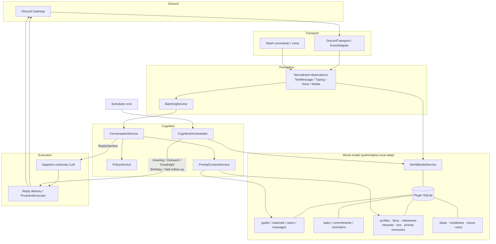
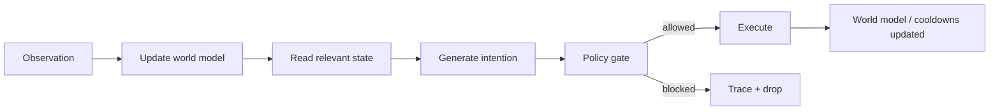

# Discord Plugin Flow

Brief map of how the Discord cognitive plugin runs. Everything below is **plugin-local** (SQLite + services) — not Sapphire core Mind memory.

## Process overview

1. **Discord events** arrive via the transport and become normalized **observations**.
2. Observations **update the world model** (guilds, channels, users, messages, tasks).
3. Chat also updates **people-memory** (profiles, facts, milestones, interests) and can use **server lore**.
4. The system generates **intentions** (reply, greeting, outreach, goodnight, birthday, task follow-up).
5. **Policy** gates risky or blocked actions; approved intentions are **executed** (LLM + Discord send).

Discord events are not treated as direct work items. They change an internal model of reality; work is expressed as intentions over that model.

## Overall architecture

## World-model loop

## Two live paths

### Reactive (chat)

Message → observation → world model + profile/interest/milestone updates → batch → trigger/policy → prompt (history + profile + lore + memory) → reply intention → Sapphire LLM → Discord.

### Proactive (cron)

Scheduler → CognitiveOrchestrator → intentions from greeting / outreach / sleep / birthdays / due world-model tasks → executor → Discord (outreach can use interest graphs).

## Where memory fits

| Layer | Role |
|-------|------|
| **World model** | What exists: servers, channels, people, recent messages, due tasks |
| **Plugin people-memory** | Who she knows: facts, milestones, interests, relationship scores |
| **Server lore** | Shared guild/channel facts (not per-user) |
| **Proactive** | Intentions from schedule + world state + interests |

People-memory and lore live in the same plugin SQLite as the world model. They enrich prompts and outreach; they do not replace the observation → world model → intention loop.

## Ambient distill (opt-in)

When **Learn from ambient chat** is enabled under Memory:

1. Member messages are buffered into `profile_buffers` (plugin DB only).
2. Cron `ambient_distill` runs every 15 minutes and distill runs for an account when its interval has elapsed (default **1 hour**, configurable).
3. An LLM (Models → Ambient distill LLM, else Reply LLM) extracts durable facts into `profile_facts` with `source=ambient_distill`.
4. Soft-forget / Browse still apply; nothing is written to Sapphire core Mind.
